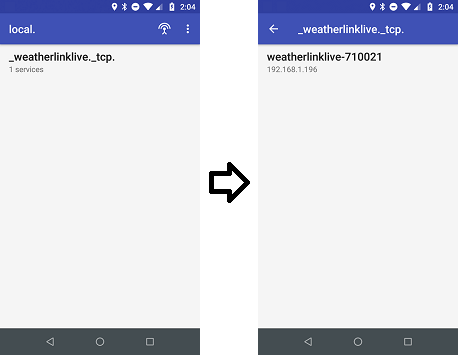

# Device Discovery Overview

The WeatherLink Live (WLL) announces itself on the network using [DNS Service Discovery](https://tools.ietf.org/html/rfc6763) over [multicast DNS (mDNS)](https://tools.ietf.org/html/rfc6762).
These technologies are also known as Zeroconf or Bonjour or Avahi.

This allows a computer or smartphone to use standard device discovery libraries to find all WeatherLink Live devices on the local network without having to know their serial numbers or IP addresses in advance.

## DNS Details
If you are familiar with DNS service discovery, the two most important parameters are the service name and the domain.
For WeatherLink Live, the service name is `_weatherlinklive._tcp` and the domain is `local`.

For most libraries, those two parameters should be all you need to plug in to start discovering WeatherLink Live devices.
In some cases, the library may expect the full DNS service record name, which for WeatherLink Live is:

    _weatherlinklive._tcp.local.

Note: there is a trailing dot at the end, and it is significant!

## Testing
For testing purposes, you can use common utilities to perform DNS discovery.

### Android

On Android, you can use the free application [Service Browser](https://play.google.com/store/apps/details?id=com.druk.servicebrowser) to view service records.

Note that you may need to first open the WeatherLink application and view your station before the service will appear in the Service Browser application.

### Windows

On Windows, you may need to first install mDNS support using [Bonjour Print Services for Windows](https://support.apple.com/kb/DL999?locale=en_US) from Apple.
Then you can use the built-in `dns-sd` command to discover devices from the command-line:

    C:\>dns-sd -B _weatherlinklive._tcp
    Browsing for _weatherlinklive._tcp
    Timestamp     A/R Flags if Domain                    Service Type              Instance Name
    16:15:05.811  Add     3 11 local.                    _weatherlinklive._tcp.    weatherlinklive-700000
    16:15:05.811  Add     3 11 local.                    _weatherlinklive._tcp.    weatherlinklive-700002
    16:15:05.812  Add     3 11 local.                    _weatherlinklive._tcp.    weatherlinklive-70000d
    16:15:05.812  Add     3 11 local.                    _weatherlinklive._tcp.    weatherlinklive-70000b

You can then ping the instance name + `.local`, e.g. `weatherlinklive-700000.local`.
On Windows, you must pass the `-4` flag to force IPv4 resolution or it will fail, e.g.:

    C:\>ping -4 weatherlinklive-700002.local
    
    Pinging weatherlinklive-700002.local [10.95.35.4] with 32 bytes of data:
    Reply from 10.95.35.4: bytes=32 time<1ms TTL=128

vs

    C:\>ping weatherlinklive-700002.local
    Ping request could not find host weatherlinklive-700002.local. Please check the name and try again.

### Linux

To test device discovery on Linux, you can use `avahi-browse`, which is bundled in the `avahi-utils` package on Debian. You can install it with `apt-get`:

    sudo apt-get install avahi-utils -y

You can then use `avahi-browse` to discover service instances:

    pi@zero:~$ avahi-browse -d local _weatherlinklive._tcp --resolve -t
    +  wlan0 IPv4 weatherlinklive-700008                              _weatherlinklive._tcp      local
    =  wlan0 IPv4 weatherlinklive-700008                              _weatherlinklive._tcp      local
    hostname = [weatherlinklive-700008.local]
    address = [10.189.36.239]
    port = [80]

## Limitations

Device discovery may not work on all networks. In order for device discovery to work, your WeatherLink Live and your phone/computer
must be on the same network, and multicast communication must be enabled on that network.

For most home networks, device discovery will just work, even if you have your computer connected via ethernet, a WeatherLink Live on 2.4GHz WiFi, and your phone on 5GHz WiFi.
As a rule of thumb, if you have a Chromecast or Fire TV stick and it works with your router, device discovery will also work for the WeatherLink Live.

### Public networks
However, some public WiFi networks (such as the "guest WiFi" mode on home routers) or the WiFi at a school or office may block multicast and other device-to-device communication, only allowing access to the internet.

On those networks, device discovery may not function correctly.

### WiFi
When the WeatherLink Live is connected via WiFi, standalone hostname queries for `weatherlinklive-<device-id>.local` may fail to resolve.
If this occurs, you may need to first perform a full service discovery query before the device will respond with its IP address.

Additionally, due to a bug in the WiFi module's implementation of mDNS, it will not respond to mDNS queries with an ID greater than 4.
To avoid this issue, set the mDNS query ID to 0.
